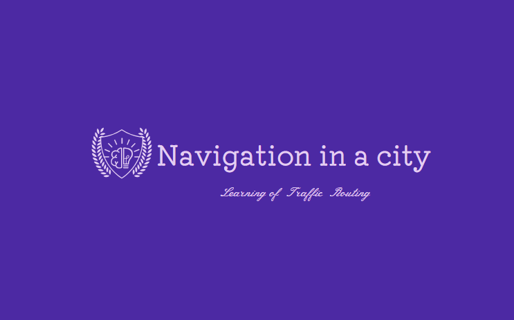

# Multi-Agent Reinforcement Learning of Traffic Routing



## Table of Contents

- [Overview](#overview)
- [Features](#features)
- [Getting Started](#getting-started)
- [Usage](#usage)
- [Contributing](#contributing)

## Overview

The Multi-Agent Reinforcement Learning of Traffic Routing project is a simulation-based approach to study and optimize traffic flow in networks of autonomous vehicles using multi-agent reinforcement learning algorithms. The project aims to model and simulate real-world traffic scenarios and enable autonomous vehicles to learn optimal routing strategies to navigate efficiently.

## Features

- **Traffic Flow Simulation:** Simulate traffic behavior based on various road parameters, weather conditions, and car characteristics.
- **Visual Representation:** Visualize the simulation results with 2D maps, heatmaps, and animations.
- **Multi-Agent Reinforcement Learning:** Apply reinforcement learning algorithms to autonomous vehicles to learn optimal path-finding strategies.
- **Graph Transformation:** Transform real-life maps into graph structures for simulation and analysis.

## Getting Started

1. Clone this repository:
   ```bash
   git clone https://github.com/your-username/multi-agent-traffic-routing.git

2. Run the Main_Gui.py file in the Controller directory to run the simulator

## Usage

**1. Start New Simulation:**

To initiate a new simulation, follow these steps:

- Launch the program and open the "Main Window."
- In the main window, click the "Start New Simulation" button.

This action will open a new window titled "New Simulation" with a set of parameters and options to configure the simulation.

**Configure Simulation Parameters:**

In the "New Simulation" window, you can configure various parameters for your simulation:

- **Enter City Name:** Type the name of the city where the simulation will take place.

- **Add Traffic White Noise:** Check this option if you want to introduce random traffic disturbances during the simulation. When enabled, the simulation will include variations in roads speeds.

- **Plot Q Learning Training Results:** Check this option if you want to visualize and analyze the training results of the Q-learning algorithm. Enabling this option allows you to monitor the learning progress. This option plots the result only if at least one agent using the Q-learning algorithm.

- **Activate Traffic Lights:** Enable this option to incorporate functioning traffic lights into the simulation, adding a layer of realism to the environment.

- **Rain Intensity:** Choose the desired rain intensity level for the simulation from the dropdown menu. The road speeds will be lower as the rain intensity is higher.

### Add New Car

Click the "Add New Car" button to introduce a new vehicle to the simulation. You can add multiple cars with different starting positions and behaviors.

- **Car's Starting Time**

Select the hour, minute, and second when the new car should start its journey.

- **Car's Starting Day**

Use the calendar widget to pick the date when the car enters the simulation.

- **Choose Source and Destination**

Click the "Choose Source and destination" button to specify the starting and ending points for the new car. After that, close the window and press "Confirm."

- **Routing Algorithm**

Choose the routing algorithm you want the car to use. Three options are available:

- Reinforcement Machine Learning (Q-Learning)
- Shortest Path
- Random Actions

- **Use Existing Q Tables**

Indicate whether the car should use existing Q tables (if available).

### Block/Unblock Road
 
Use the "Block/Unblock Road" button to toggle the accessibility of specific road segments within the city map. This feature allows you to simulate road closures or restrictions.

- **Road's Blockage Starting Time**

Set the hour and minute when the road blockage begins.

- **Road's Blockage Starting Day** 

Use the calendar to select the date when the road blockage commences.

- **Road's Blockage Ending Time** 

Specify the hour and minute when the road blockage ends.

- **Road's Blockage Ending Day** 

Use the calendar to choose the date when the road blockage concludes.

- **Choose Road To Block** 

Click the "Choose Road To Block" button to select the road segment you want to block, after that close the window and press "Confirm".

**2. Load Simulation:**

- Use the "Load Simulation" button to load an existing simulation from a saved file.
- This feature is useful when you want to continue working with a previously created simulation or view its results.

**3. Route Comparison:**

- Click the "Route Comparison" button to initiate a route comparison between different routes.
- This option helps you compare multiple navigation routes, making it easier to make informed decisions.

**4. Settings:**

- **Enter Q Learning Number Of Steps**

Specify the number of steps for the Q-learning algorithm. This parameter affects how quickly the Q-learning agents learn and adapt their behavior.

- **Enter Q Learning Number Of Episodes**

Determine the number of episodes for the Q-learning algorithm. Each episode represents a complete learning cycle. A higher number of episodes allows the Q-learning agents to gain more experience and refine their strategies.

- **Enter Car Duration (Hours)**

Set the duration for each car's journey in hours. This parameter controls the time frame within which the simulated cars navigate through the city.

- **Confirm Settings**

After configuring your desired settings, click the "Confirm" button to save your changes and apply them to the simulation. The "Settings" window will close, and your customized settings will be used in the simulation.

## Contributing

- Alon Reicher
- Liad Gam
